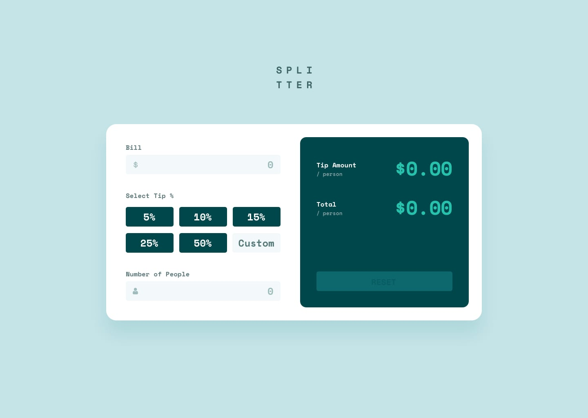
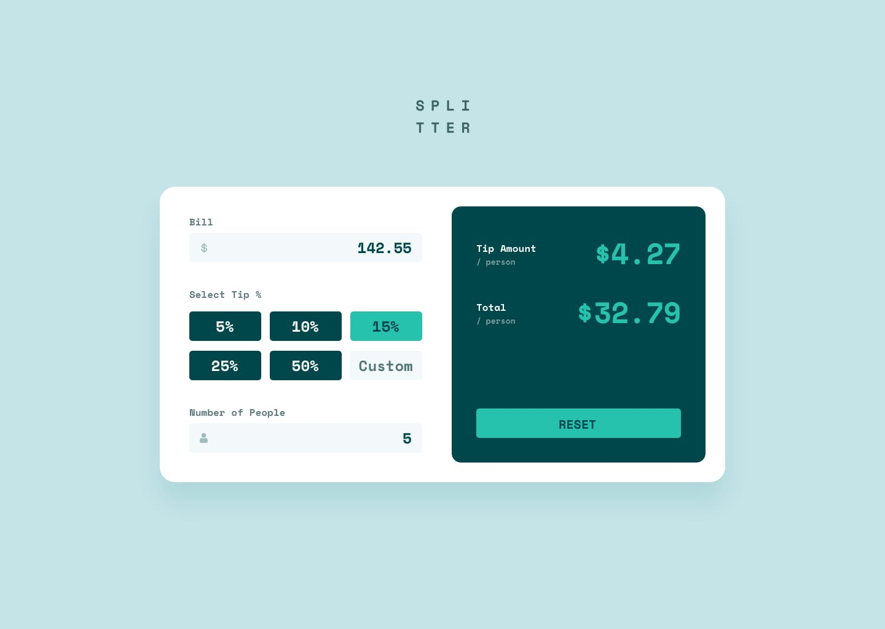
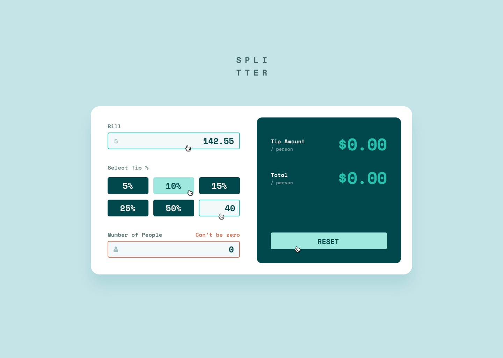
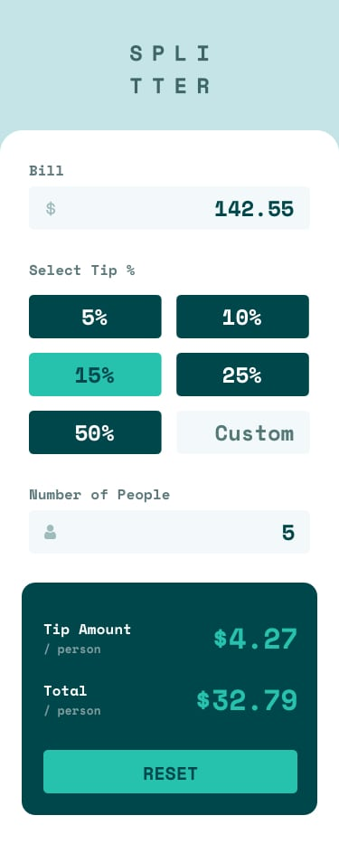

# Frontend Mentor - Solución de Tip Calculator App

Esta es mi solución al desafío **Tip Calculator App** de Frontend Mentor. Este proyecto se centra en construir una calculadora de propinas completamente responsive que permite a los usuarios calcular el monto de la propina y el costo total por persona según el valor de la cuenta, el porcentaje de propina seleccionado y el número de personas.

Este desafío fue una excelente oportunidad para practicar diseños responsivos, HTML semántico, manejo de formularios, manipulación del DOM, JavaScript basado en eventos, personalización de Tailwind CSS y despliegue de una aplicación en producción utilizando Vite y GitHub Pages.

---

## Tabla de contenidos

* [Descripción general](#descripción-general)
* [El desafío](#el-desafío)
* [Diseño](#diseño)
* [Enlaces](#enlaces)
* [Mi proceso](#mi-proceso)
* [Construido con](#construido-con)
* [Lo que aprendí](#lo-que-aprendí)

---

## Descripción general

Este proyecto es una aplicación responsive para calcular propinas que permite a los usuarios calcular:

* Monto de la propina por persona.
* Total a pagar por persona.

Los usuarios pueden elegir entre porcentajes de propina predefinidos o ingresar un porcentaje personalizado. La interfaz se actualiza dinámicamente a medida que el usuario introduce información, sin necesidad de recargar la página.

El diseño es completamente responsive y se adapta perfectamente a dispositivos de escritorio, tabletas y móviles utilizando un enfoque mobile-first y las clases utilitarias de Tailwind CSS.

---

## El desafío

Los usuarios deben poder:

* Ver el diseño óptimo según el tamaño de pantalla de su dispositivo.
* Introducir el valor de la cuenta.
* Seleccionar un porcentaje de propina predefinido.
* Introducir un porcentaje de propina personalizado.
* Introducir el número de personas que compartirán la cuenta.
* Ver el monto de la propina por persona calculado.
* Ver el monto total por persona calculado.
* Restablecer la calculadora a su estado inicial.
* Visualizar estados activos, hover y deshabilitados en los elementos interactivos.
* Disfrutar de una experiencia responsive en dispositivos de escritorio, tabletas y móviles.

---

## Diseño

### Diseño de Escritorio Vacío



### Diseño de Escritorio Completo



### Estados Activos



### Diseño Móvil



---

## Enlaces

* URL de la solución: [Repositorio en GitHub](https://github.com/mlopezl/tip-calculator-app-challenge)
* URL del sitio en vivo: [Demo en vivo](https://mlopezl.github.io/tip-calculator-app-challenge/)

---

## Mi proceso

* Estructuré la aplicación utilizando elementos semánticos de HTML5 como `form`, `section`, `label` y `button`.

* Seguí un enfoque mobile-first para garantizar la adaptabilidad en diferentes tamaños de pantalla.

* Construí los layouts utilizando Flexbox y clases utilitarias de Tailwind CSS.

* Implementé puntos de ruptura responsivos mediante:

  * `sm:`
  * `md:`
  * `lg:`

* Personalicé Tailwind CSS v4 utilizando la directiva `@theme`.

* Creé un sistema de diseño personalizado utilizando variables CSS para:

  * Colores
  * Tipografía

* Importé y configuré la fuente Space Mono desde Google Fonts.

* Construí botones de selección de propina personalizados mediante radio buttons estilizados.

* Utilicé la pseudo-clase CSS `:has()` a través de variantes de Tailwind para crear estados activos en los botones de porcentaje.

* Eliminé los controles predeterminados de los inputs numéricos utilizando selectores arbitrarios de Tailwind.

* Gestioné el estado de la aplicación mediante event listeners de JavaScript.

* Añadí manejo de eventos para:

  * `input`
  * `change`
  * `focus`
  * `reset`

* Seleccioné elementos del DOM utilizando:

  * `getElementById()`
  * `querySelectorAll()`

* Convertí NodeLists en arrays mediante `Array.from()`.

* Utilicé métodos modernos de arrays como:

  * `forEach()`
  * `find()`

* Realicé validaciones de entrada antes de ejecutar los cálculos.

* Calculé dinámicamente el monto de la propina y el total utilizando funciones reutilizables.

* Formateé valores monetarios utilizando `toFixed(2)`.

* Habilité y deshabilité dinámicamente el botón de reinicio mediante manipulación de atributos del DOM.

* Disparé eventos personalizados utilizando `dispatchEvent()`.

* Construí y optimicé el proyecto utilizando Vite.

* Generé una versión de producción mediante:

```bash
pnpm run build
```

* Desplegué la versión de producción en GitHub Pages.

* Organicé los recursos generados para garantizar la compatibilidad con el alojamiento estático.

---

## Construido con

* HTML5
* Tailwind CSS v4
* JavaScript (ES6+)
* Flexbox
* Variables CSS (Custom Properties)
* Google Fonts
* Principios de Diseño Responsive
* Flujo de trabajo Mobile-first
* HTML Semántico
* Manipulación del DOM
* Event Listeners
* Validación de Formularios
* Métodos de Arrays (`forEach`, `find`)
* Eventos Personalizados (`dispatchEvent`)
* Selectores Arbitrarios de Tailwind
* Variantes `has()` de Tailwind
* Vite
* PNPM
* GitHub Pages

---

## Lo que aprendí

* Construir interfaces responsivas utilizando HTML5 semántico.
* Crear layouts de manera eficiente con Flexbox y las utilidades de Tailwind CSS.
* Trabajar con Tailwind CSS v4 y su nuevo sistema de configuración mediante `@theme`.
* Crear tokens de diseño reutilizables mediante variables CSS.
* Integrar fuentes externas utilizando Google Fonts.
* Personalizar controles de formularios y grupos de radio buttons.
* Utilizar selectores arbitrarios de Tailwind para modificar comportamientos predeterminados del navegador.
* Aprovechar la pseudo-clase CSS `:has()` para crear estados dinámicos de interfaz.
* Seleccionar y manipular elementos del DOM de manera eficiente.
* Gestionar interacciones de usuario mediante diferentes tipos de eventos.
* Convertir NodeLists en arrays para facilitar su manipulación.
* Utilizar métodos modernos de JavaScript como `forEach()` y `find()`.
* Validar entradas de usuario antes de realizar cálculos.
* Formatear valores monetarios utilizando `toFixed()`.
* Disparar y gestionar eventos personalizados mediante `dispatchEvent()`.
* Controlar el estado de la interfaz mediante atributos del DOM.
* Comprender el flujo de desarrollo y producción de Vite.
* Generar versiones optimizadas para producción con Vite.
* Desplegar aplicaciones frontend estáticas utilizando GitHub Pages.
